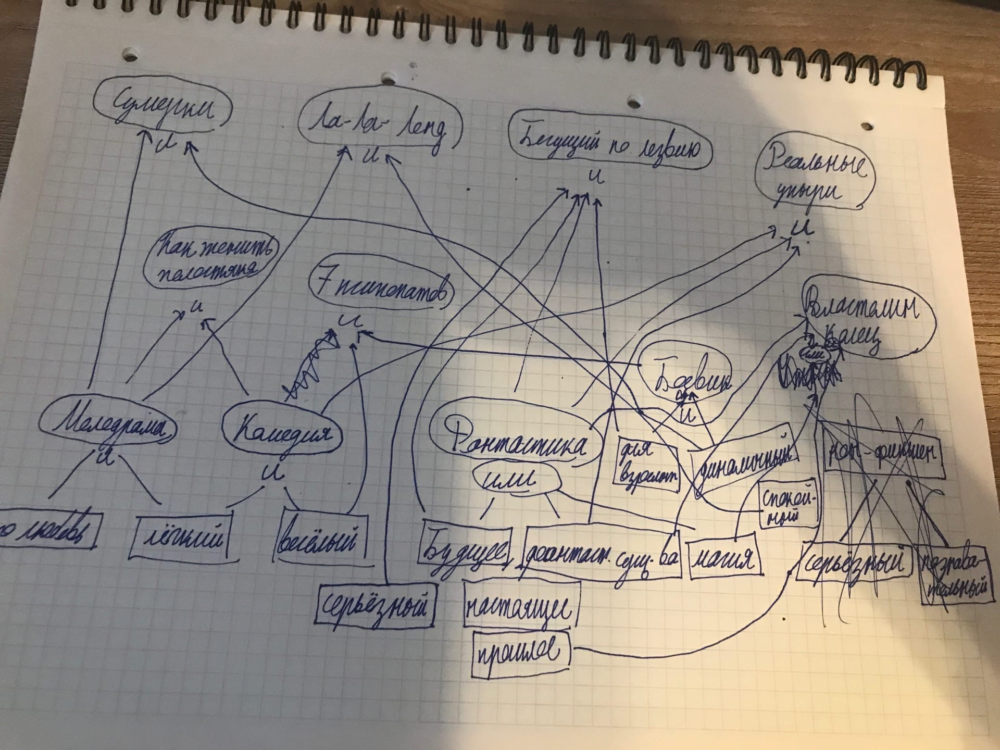

# Отчет по лабораторной работе
## по курсу "Искусственый интеллект"

### Студенты: 

| ФИО       | Роль в проекте                     | Оценка       |
|-----------|------------------------------------|--------------|
| Семенов | Наполнение системы правилами, написание отчёта |          |
| Скворцов | Написание отчёта |       |
| Патрикеева| Наполнение системы правилами, тестирование |      |
| Петрин   | Наполнение системы правилами, Написание отчёта |          |
| Синявский   | Описал общую схему предметной области, выбор экспертной системы, наполнение системы правилами, написание отчёта |          |

## Результат проверки

| Преподаватель     | Дата         |  Оценка       |
|-------------------|--------------|---------------|
| Сошников Д.В. |              |     2.7          |

> *База знаний примитивна. Работа выполнена с существенным опозданием.*

## Тема работы

Рекомендательная система по подбору фильма на основе препочтений. Хочется ли посмотреть лёгкий или серьёзный фильм, какой сеттинг предпочитает зритель и т.д.

## Концептуализация предметной области

Выделенные понятия:
1. настроение
2. сеттинг
3. жанр
4. динамичность
5. возрастной ценз


Тип онтологии: иерархия.
Тип знаний: статистические.
Разделение предметной области: Каждый выбрал свой любимый фильм, и начал выявлять критерии, которыми его можно было бы описать. Все старались выявить уникальную для фильма комбинацию параметров

Фильмы, которые может порекомендовать наша экспертная система:
Сумерки, Как женить холостяка, Ла-Ла Ленд, 7 Психопатов, Бегущий по лезвию, Реальные упыри(What We Do in The Shadows), Властелин Колец.

графическая иллюстрация:


## Принцип реализации системы

Опишите:
 - Какой механизм вывода вы предполагаете использовать и почему
 - Какую систему программирования вы предполагаете использовать и почему
 - Если это имеет смысл, приведите графическую иллюстрацию архитектуры системы. Если система состоит из разных частей (бот, механизм вывода) - опишите принципы интеграции

Мы решили использовать механизм обратного вывода, так как он подразумевает понятный для пользователя диалоговый режим, и даже если подходящего фильма не окажется в нашей системе, отвечая на вопросы, пользователь сможет лучше понять, что конкретно он хочет посмотреть.
Мы использовали язык Python, потому что он нам хорошо знаком, а также на лекциях нам давали подробный пример реализации экспертной системы с обратным выводом именно на этом языке.

## Механизм вывода

Механизм обратного вывода работает следующим образом: система как бы пытается "угадать" ответ, перебирая все варианты. Так как заранее многие параметры неизвестны, система уточняет их через диалог с пользователем. По ходу получения информации предположение может оказаться ошибочным, тогда система переходит к следующему предположению. Вся информация при этом сохраняется в памяти системы.


## Протокол работы системы
```bash
/usr/bin/python3.6 /home/anri/Documents/Progs_3_course_2_sem/AI_expert_system/main.py
про любовь
y/n
n
мелодрама
y/n
n
динамичный
y/n
n
боевик
y/n
n
будущее
y/n
n
фантастические существа
y/n
y
лёгкий
y/n
y
весёлый
y/n
y
реальные упыри
```

## Выводы

Проделав работу, мы узнали, как на практике работают экспертные системы, что они из себя представляют и какими бывают. Мы попробовали себя в роли экспертов, и с удивлением обнаружили, что даже в такой знакомой всем области знаний, как фильмы, очень трудно выявить осмысленные закономерности, чтобы классифицировать знания. Выступать в роли экспертов командой оказалось непросто, так как у каждого члена команды понимание того, как "правильно" категоризовать фильмы, немного отличалось.
Вероятно, именно поэтому системы рекоммендаций фильмов, например на платформе Netflix, основаны на гораздо более сложных алгоритмах машинного обучения.
